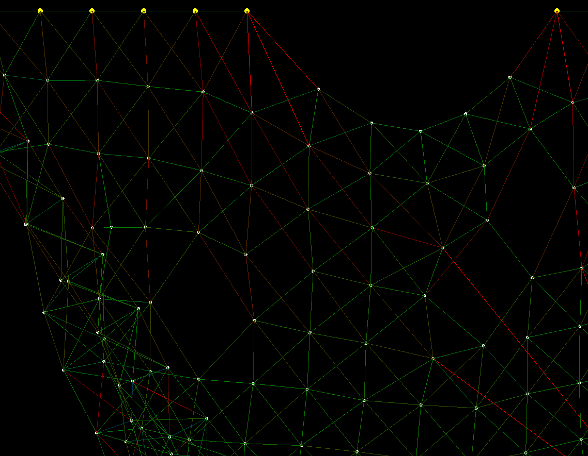

# Connected Dots

## What is this?

Sometimes I come up with random ideas. This was one of them. I saw an image of
connected dots and thought it would be interesting to make a simulation for
this.

## Game Engine

Because computer graphics are best supported by game engines I decided to use
one instead of any other language with extra library. In this case I am using
**GODOT** because it is open sourcen and lightweight.

## Preview

## Getting started

Download the latest version of **GODOT** and load the project. Hit **RUN** and
play around with the dots
